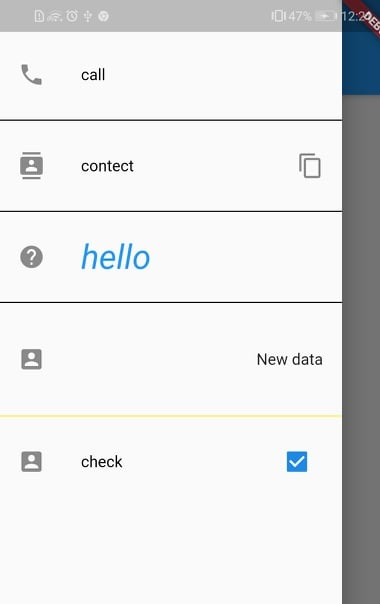

# drawer_component

A Flutter implementation of easy useable component used in drawer to design beautiful Applications.


## Features

This library will allow you to design the drawer components without any additional hastle. The major type of componnets that could be designed include buttons, icons buttons, custom widgets, dividers and boolean check buttons. The basic idea is to use this libarary to reduce the coding effort while designing the drawer componnets of your android and IOS applications. New version 0.2.0 include an beautiful logo for Drawer as will the newer version also had fixed issue in ComponentDrawer and tranformed it to DrawerTile which is more flexible . Furthermore Logo contains many fetures that could customize the drawer including the gradient and custom text widgets designed to make programmers job easier .

## How to use this Component

### Drawer

It contain number of checks to make component more dynamic for example if you want to add gradient you could add true to gradient check. If you want to add many text widgets or your own widgets instead of the usual defult text widget provided by the DrawerComponent tou could check true to customTextwidgetsCheck . More there is a check for selection for asset image instead of network image checkNetworkAssets ;

It have 3 required parameters circleAvatarImageurl , checkNetworkAssets (use to select between asset image and network image ) , avatarradius ;


```
 DrawerLogo(
                    avatarBackgroundColor: Colors.white,
                    circleAvatarImageurl:
                        "https://i.ytimg.com/vi/sK-8k1Dq1xM/hqdefault.jpg",
                    checkNetworkAssets: true,
                    color: Colors.blue,
                    text: "qwerty",
                    avatarradius: 50,
                  ),
```

### Drawer Tile

There is a divider check use to add or remove the divider set divideravailabilityCheck = true or false .
I have 4 requied atributes name , tileSize , child , textOverflow . It was avalible in previous versions as well with the name DrawerComponent know in new version it is improved to drawerTile



```
drawer: new Drawer(
    child: ListView(
    children: <Widget>[
            DrawerTile(
                    name: "call",
                    textOverflow: TextOverflow.ellipsis,
                    child: TestWidget(),
                    leading: Icon(Icons.call),
                    tileSize: 10,
                    dividerheight: 5,
                    dividerThickness: 1,
                    dividercolor: Colors.black,
                  ),
                ],
        ),
);

```

## geting started

1. Add this to your package's pubspec.yaml file:

```
dependencies:
  drawer_component: ^0.2.1

```

2. Install it
   You can install packages from the command line:
   with Flutter:

```
$ flutter pub get

```

Alternatively, your editor might support flutter pub get. Check the docs for your editor to learn more.

3. Import it
   Now in your Dart code, you can use:

```
import 'package:drawer_component/drawer_component.dart';

```
